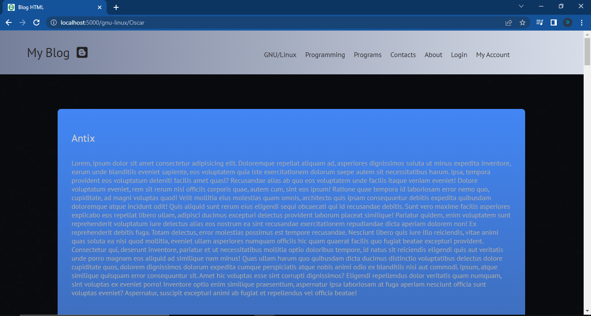

# Python Blog.

__A small blog using python-flask, html, css and javascript. Also using bcrypt module for encrypt the passwords of users in sqlite3 database.__

## Installation.

### Using Docker.

```bash
docker run -p 5000:5000 -d eduarddan/python-blog
```

### Manual.

```bash
git clone https://github.com/EduardYan/python-blog.git

cd python-blog/

```

#### Dependencies.
Installing with pip3 using the requirements file.

```bash
pip3 install -r requirements.txt
```

#### Run.

```bash
python3 index.py
```

----------------------------------

__Now you can visit this direction from the browser for watch the blog:__ <a href="http://localhost:5000/login" target="_blank" rel="noreferrer">http://localhost:5000/login</a>

----------------------------------

## Screenshot.



## Errors or Bugs.
__Contact me__
<a href="mailto:eduarygp@gmail.com">My email</a>
